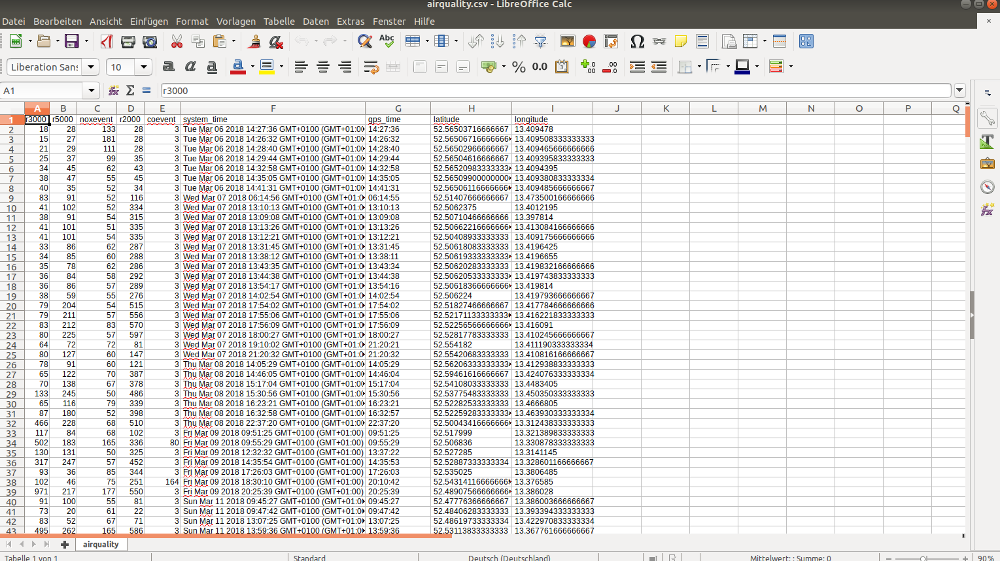

# CSV-Parser #

### Create a CSV-data from a database ###

This is a project, which reads the database and write the data into a csv file.

### To make it run, you have to install seperate things: ###

first you have to install **nmp**:

+ npm install -y 

then you have to do:

+ npm init

after that you have to install **mongoose**:

+ npm -i mongoose --save

also you have to install **dotenv**:

+ npm install dotenv --save

and to start the database:

+ mongod

and the output will look as following:

